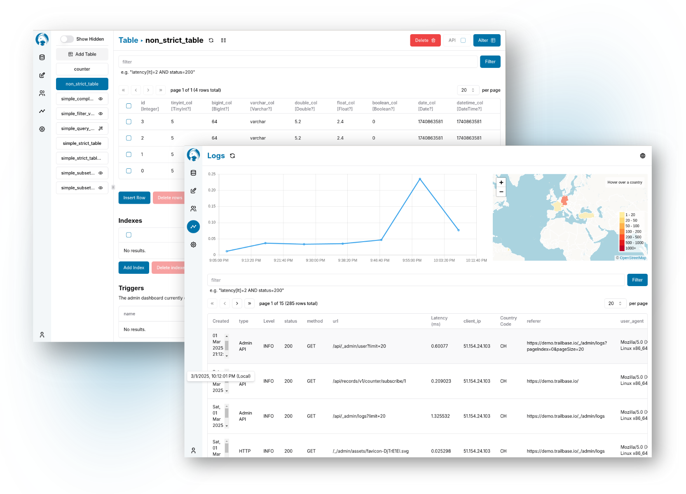

<p align="center">
  <a href="https://trailbase.io" target="_blank">
    <picture>
      
    </picture>
  </a>
</p>

<p align="center">
  An open, <a href="https://trailbase.io/reference/benchmarks/">blazingly fast</a>,
  single-executable Firebase alternative with type-safe REST & realtime APIs, built-in JS/ES6/TS
  runtime, SSR, auth and admin UI built on Rust, SQLite & V8.
<p>

<p align="center">
  Simplify with fewer moving parts: an easy to self-host, single-executable,
  extensible backend for your mobile, web or desktop application.
  Sub-millisecond latencies eliminate the need for dedicated caches, no more
  stale or inconsistent data.
<p>

<p align="center">
  <a href="https://github.com/trailbaseio/trailbase/stargazers/">
    
  </a>
  <a href="https://github.com/trailbaseio/trailbase/actions?query=branch%3Amain">
    
  </a>
  <a href="https://github.com/trailbaseio/trailbase/blob/main/LICENSE">
    
  </a>
  <a href="https://trailbase.io/reference/roadmap/">
    
  </a>
</p>

# TrailBase

<p align="center">
  <a
    href="https://demo.trailbase.io/_/admin?loginMessage=E-mail:%20admin@localhost%20%E2%80%A2%20Password:%20secret"
    target="_blank"
  >
    <picture>
      
    </picture>
  </a>
</p>

<p align="center">
  <strong>
    Try the
    <a href="https://demo.trailbase.io/_/admin?loginMessage=E-mail:%20admin@localhost%20%E2%80%A2%20Password:%20secret" target="_blank">
      demo
    </a> online
  </strong>
  <br/>Email: <em>admin@localhost</em>
  <br/>password: <em>secret</em>.
</p>

For more context, documentation, and a live demo, check out the website:
[trailbase.io](https://trailbase.io).
Questions? Thoughts? - Take a look at the
[FAQ](https://trailbase.io/reference/faq/) or reach out.
If you like TrailBase or want to follow along, consider leaving a ⭐🙏.

## Project Structure & Releases

This repository contains all components that make up TrailBase including client
libraries, tests, documentation and examples.
Only the [benchmarks](https://github.com/trailbaseio/trailbase-benchmark) are
kept separately due to their external dependencies.

Pre-built static binaries are available as
[GitHub releases](https://github.com/trailbaseio/trailbase/releases/) for
Linux, MacOS and Windows.
On Windows the Docker [image](https://hub.docker.com/r/trailbase/trailbase) can
be used.

Client packages for various languages are available via:

- [JavaScript/TypeScript](https://www.npmjs.com/package/trailbase)
- [Dart/Flutter](https://pub.dev/packages/trailbase)
- [Rust](https://crates.io/crates/trailbase-client)
- [C#/.Net](https://www.nuget.org/packages/TrailBase/)
- [Python](https://pypi.org/project/trailbase/)

## Running

You can get TrailBase either as a pre-built static binary (MacOS &
Linux), run it using [Docker](https://hub.docker.com/r/trailbase/trailbase)
(Windows, MacOS, Linux, ...), or [build](#building) it from source.

The latest pre-built binaries can be downloaded from [GitHub
releases](https://github.com/trailbaseio/trailbase/releases/) and run via:

```bash
$ ./trail run
```

Thanks to `trail` being a single static binary, there's no need to install
anything including system dependencies.
This also means that you can confidently update your system and deploy to
different machines without having to worry about prior set-up or shared
library compatibility.

Using [Docker](https://hub.docker.com/r/trailbase/trailbase), you can run the
following, which will also create and mount a local `./traildepot` asset
directory:

```bash
$ mkdir traildepot
$ alias trail="docker run -p 4000:4000 --mount type=bind,source=$PWD/traildepot,target=/app/traildepot trailbase/trailbase /app/trail"
$ trail run
```

To get a full list of commands, simply run `trail --help` .

## Building

If you have all the necessary dependencies (Rust, protobuf, node.js, pnpm)
installed, you can build TrailBase by running:

```bash
$ git submodule update --init --recursive
$ cargo build --release
```

To build a static binary you have to explicitly specify the target platform,
e.g. for Linux using glibc:

```bash
$ RUSTFLAGS="-C target-feature=+crt-static" cargo build --target x86_64-unknown-linux-gnu --release
```

Alternatively, if you want to build a Docker image or don't have to deal with
build dependencies, you can simply run:

```bash
$ git submodule update --init --recursive
$ docker build . -t trailbase
```

## Contributing

Contributions are very much appreciated 🙏. For anything beyond bug fixes,
let's briefly chat to see how a proposal fits into the overall roadmap and
avoid any surprises.

We're not sure yet what the best setup or exact license is for compatibility
between OSL-3.0 and more popular licenses or use as a framework.
So we'd ask you to sign a simple CLA that retains your copyright, ensures that
TrailBase will continue to forever be freely available under an OSI-approved
copyleft license, while allowing for some flexibility and sub-licensing as
established by much larger, successful projects such as Grafana or Element.

## License

TrailBase is free software under the terms of the [OSL-3.0](LICENSE).

We chose this license over more popular, similar copyleft licenses such as
AGPLv3 due to its narrower definition of derivative work that only covers
modifications to TrailBase itself. This is similar to GPL's classpath or LGPL's
linkage exception allowing the use of TrailBase as a framework without
inflicting licensing requirements on original work layered on top.
That said, we ain't lawyers. The author of the license provides a more thorough
[explanation](https://rosenlaw.com/OSL3.0-explained.htm). If you have any
concerns or advice for us, please reach out.

If you require an
[exception](https://www.gnu.org/philosophy/selling-exceptions.html), reach out
to contact@trailbase.io.
