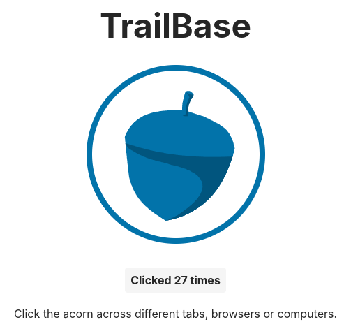

import { Code } from "@astrojs/starlight/components";
import { githubPath } from "@/lib/github";
import { repo } from "@/config";

This article is a short introduction to some of TrailBase more advanced
features, specifically server-side rendering with a popular JS framework
(React, Vue, Svelte, Solid) and *realtime* subscriptions to data changes.

We'll built a simple *clicker* game, where players can increment a globally
shared counter by click a button and updates are automatically send out to all
participants.

<div class="flex justify-center">
  <div class="w-[360px] shadow-lg	 ">
    
  </div>
</div>

<div class="h-[24px]" />

The conclusion of this tutorial is part of the main code repository and can be found
<a href={githubPath("examples/collab-clicker-ssr")}>here</a>
or downloaded by running:

<Code
  code={`
$ git clone ${repo}
$ cd trailbase/examples/collab-clicker-ssr
  `}
  lang="bash"
  frame="none"
/>

import GettingTrailBase from "./_getting_trailbase.mdx";

<GettingTrailBase/>

## Creating an SSR Template Project

We start by setting up a server-side rendered (SSR) application that will
ultimately render in TrailBase's JS/TS runtime.
Because it's JavaScript there's no single way to set up a new project, there's
a million good ones and a *few* more questionable ones 😅.
For this tutorial we'll use `vite`, which has gained notable traction and
provides templates for most popular frameworks. As for frameworks, we'll use
Solid but the same approach applies to React, Vue, Svelte, Preact, ... .

Let's run:

```bash
pnpm create vite@latest <project-name>
```

which will bring up a CLI assistant. Navigate through: `Others > create-vite-extra >
ssr-solid > TypeScript`. If you feel adventures, you can select any of the
other SSR options (React, Svelte, ...) or go with JavaScript instead.

With the project template created, we can simply follow the on-screen
instructions:

```bash
cd <project-name>
pnpm install
pnpm run dev
```

export const createViteBase = "https://github.com/bluwy/create-vite-extra/blob/b03295a95d608d3120b8f620d1df2657eb07811d";

The final command, will start an [express.js](https://expressjs.com/)
development server run by Node.js as defined by `<project-name>/server.js`.
Opening the
<a href={`${createViteBase}/template-ssr-solid-ts/server.js#L41-L63`}>`server.js` implementation</a>,
marginally simplified it looks something like:

```ts
async function handler(req, res) {
    const render = (await import('./dist/server/entry-server.js')).render;

    const rendered = await render(req.url);

    const html = templateHtml
      .replace(`<!--app-head-->`, generateHydrationScript())
      .replace(`<!--app-html-->`, rendered.html);

    res.status(200).set({ 'Content-Type': 'text/html' }).send(html)
}
```

The details are not super important and framework-dependent but in simple terms:

1. The server first loads and executes a render function defined in `dist/server/entry-server.js`.
2. Then cuts up an
   <a href={`${createViteBase}/template-ssr-solid-ts/index.html`}>HTML template</a>
   and string-replaces two parts:
   * places a serialized "hydration" script into the header,
   * and puts the output of the render function as the body of the HTML document.

With the actual rendering delegated to the respective JS framework, this is
really all that's needed for SSR.
In other words, the above steps is all our TrailBase JS/TS handler will have to
do.

Before we start plumbing it might be worth pointing out that everything under
`dist/` are artifacts vite produces from their respective counterparts under
`src/`.
For example, we can take a look at the above render function peeking into
`src/entry-server.tsx`. Besides the `dist/server` artifacts, there are
`dist/client` artifacts. These are simply static content (HTML, CSS, JS)
intended for the user's browser, which we can serve using
`trail run --public-dir=<client-artifacts-path>` without further intervention.


## Implementing the SSR Handler

As discussed above, we ultimately want to execute something akin to:

```ts
import { render } from "dist/server/entry-server.js";
const htmlBody : string = render(/*...*/);
```

to put the body along some hydration script into our
`<project-name>/index.html` template.

Let first address a minor obstacle. Running `pnpm build` and looking at the
`dist/server/entry-server.js` artifact we can see that the code is non-hermetic
depending on framework modules.
In order to make our lives easier, let's inline everything by changing
`vite.config.ts` to:

```ts  {3-5}
export default defineConfig({
  plugins: [solid({ ssr: true })],
  ssr: {
    noExternal: true,
  },
})
```

Running `pnpm build` again, we have a standalone renderer without external
dependencies 👍.

We can now implement the handler in an existing TrailBase setup (or simply run
`trail run` once before to generate a `traildepot` directory) by creating a
`traildepot/scripts/main.ts`

```ts
import { addRoute, htmlHandler, fs } from "../trailbase.js";
import { render } from "./entry-server.js";

/// Register a root handler.
addRoute(
  "GET",
  "/",
  htmlHandler(async (req) => {
    const template = await fs.readTextFile('dist/client/index.html');

    const rendered = render(req.uri, count);

    const html = template
      .replace(`<!--app-head-->`, rendered.head ?? '')
      .replace(`<!--app-html-->`, rendered.html ?? '');

    return html;
  }),
);
```

Voila! Last things to do, satisfy the implicit dependencies:

1. Satisfy the import by copying `dist/server/entry-server.js` to `traildepot/scripts/`.
2. Satisfy the template loading by ensuring `dist/client/index.html` is a valid
   path relative to the `trail` process' current working directory or update the
   path.

Lastly we need to pass the correct path to the client HTML, CSS and JS
artifacts as `--public-path`:

```bash
trail --data-dir=traildepot run --public-dir=dist/client
```

With that, we have our SSR app running with TrailBase 🎉.


## Building the Actual App

If SSR is what you're after, the tutorial could end here. If you have a few
more minutes, let's build something a little more fun: a clicker app to
collaborative increment a globally shared counter 🤣.

For this we need a few foundational pieces:

1. Create a table with a single record holding the current global counter value.
2. A way to forward the counter state from the initial server-side render to
   the client in a structured manner so we can continue to increment it[^1].
3. An API to increment the counter.
4. Add the actual button and a subscription to get notified whenever someone
   else increments the counter.

The following sections will cover the major beats but skip over some incrementally
evolving glue code to avoid being overly redundant.
Hopefully you can work things out with a little help from the compiler.
If not, you can find the final product
<a href={githubPath("examples/collab-clicker-ssr")}>here</a>
to read along or after finishing the tutorial.

### 1. Setting up the Database

Using TrailBase's migrations, we can simply add a migration file that will
create the schema and the counter entry:

export const migration = `
CREATE TABLE IF NOT EXISTS counter (
  id           INTEGER PRIMARY KEY,
  value        INTEGER NOT NULL DEFAULT 0
) STRICT;

INSERT INTO counter (id, value) VALUES (1, 5);`;

<Code
  code={migration}
  lang="sql"
  title={`traildepot/migrations/U${Math.floor(Date.now()/1000)}__create_table_counter.sql`}
/>

Note, if you're working with a preexisting TrailBase setup, the timestamp in
the file name needs to be larger than your most recent migration.

### 2. Forwarding Server State

We'll simply serialize our state to JSON and inject it as a simple JS script
into the HTML document next to the hydration script.

export const serverEntryPoint = `
export function render(_url: string, count: number) {
  const data = { count } satisfies Clicked;

  return {
    html: renderToString(() => <App initialCount={count} />),
    // Script to set __INITIAL_DATA__ state object on the client from
    // serialized server state.
    data: \`<script>window.__INITIAL_DATA__ = \${JSON.stringify(data)};</script>\`,
  };
}`;

<Code
  code={serverEntryPoint}
  lang="ts"
  title={"src/entry-server.tsx"}
  mark={8}
/>

Afterwards we can update the client's entry-point to read the state object and
inject it into the JS app using the appropriate mechanism for your framework
choice:

export const clientEntryPoint = `
hydrate(
  () => {
    const initialData = window.__INITIAL_DATA__;
    return (
      // Injecting state into the Solid component.
      <App initialCount={initialData?.count ?? 0} />
    );
  },
  document.getElementById('root') as HTMLElement,
)`;

<Code
  code={clientEntryPoint}
  lang="ts"
  title={"src/entry-client.tsx"}
  mark={6}
/>

We also need to update the handler code to query the current count and wire it
into the server-side render function above:

```ts {5-11}
addRoute(
  "GET",
  "/",
  htmlHandler(async (req) => {
    const rows = await query(
      "SELECT value FROM counter WHERE id = 1",
      [],
    )

    const count = rows.length > 0 ? rows[0][0] as number : 0;
    const rendered = render(req.uri, count);

    // ... template stitching code
  }));
```

### 3. Counter Increment API

We could use record APIs and first read the current `value` and subsequently
write `value+1`, however this would lead to data races potentially loosing
concurrent updates and under-counting.
Instead we want an atomic database update. For this we create a new TS endpoint
in `traildepot/scripts/main.ts`:

```ts
addRoute(
  "GET",
  "/clicked",
  jsonHandler(async (_req) => {
    const rows = await query(
      "UPDATE counter SET value = value + 1 WHERE id = 1 RETURNING value",
      [],
    )

    const count = rows.length > 0 ? rows[0][0] as number : -1;
    return { count };
  }),
);
```

We'll see in the following paragraph how this endpoint can be called from
`src/App.tsx`.

### 4. UI & Record Subscription

We simply need to expose the `counter` table through a world-readable record
API (using the admin UI or config file):

```proto
# file: traildepot/config.textproto
# schema-file: <repo>/crates/core/proto/config.proto
record_apis: [
  # ...
  {
    name: "counter"
    table_name: "counter"
    acl_world: [READ]
  }
]
```

Afterwards we can build the UI and use the `trailbase` client library to
subscribe as follows:

export const clientCode = `
export function App({ initialCount }: { initialCount?: number }) {
  const [count, setCount] = createSignal(initialCount ?? 0)

  const onClick = () => {
    setCount((count) => count + 1);

    fetch("/clicked").then(async (response) => {
      const clicked = (await response.json()) as Clicked;
      if (clicked.count > count()) {
        setCount(clicked.count);
      }
    });
  };

  onMount(async () => {
    const client = new trailbase.Client(window.location.origin);
    const api = client.records("counter");

    const reader = (await api.subscribe(/*counter_id=*/1)).getReader();

    while (true) {
      const { done, value } = await reader.read();
      if (done) { break; }

      const update = value as { Update?: { value?: number } };
      const updatedCount = update.Update?.value;
      if (updatedCount && updatedCount > count()) {
        setCount(updatedCount);
      }
    }
  });

  return (
    <div class="flex flex-col gap-4 text-neutral-800">
      <div>
        <button class={buttonStyle} onClick={onClick}>
          
        </button>
      </div>

      <button class="px-4 py-2" onClick={onClick}>
        <span class="p-2 bg-neutral-100 rounded font-bold">
          Clicked {count()} times
        </span>
      </button>
    </div>
  )
}

const buttonStyle =
  "p-2 rounded-full hover:bg-accent-200 hover:scale-100 active:scale-90 animate-all";
`;

<Code
  code={clientCode}
  lang="tsx"
  title={"src/App.tsx"}
/>

## Conclusion

At this point you should hopefully have a little collaborative clicker *game* 🎉.
If you got lost along the way - apologies . You can check out the final result
<a href={githubPath("examples/collab-clicker-ssr")}>here</a>.


## What's Next?

Thanks for making it to the end.
Beyond the basic example above, the repository contains a more involved examples, such as:

* A <a href={githubPath("examples/blog")}>Blog</a>
  with both, a Web and Flutter UI, more complex APIs, authorization and custom
  user profiles.

Any questions or suggestions? Reach out on GitHub and help us improve the docs.
Thanks!

----

[^1]:
    We could technically parse the value out of the rendered DOM, though we'd
    like to be a bit more robust against future changes to the DOM.
