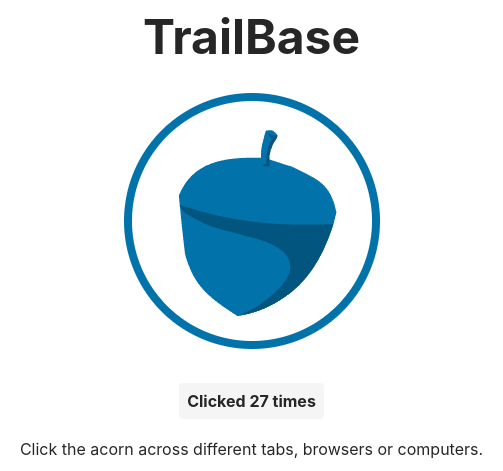

import { Code } from "@astrojs/starlight/components";
import { Aside } from "@astrojs/starlight/components";

This article is a short introduction to some of TrailBase more advanced
features: server-side rendering with popular JS framework (React, Vue, Svelte,
Solid) and "realtime" APIs to subscribe to data changes.

We'll built a simple "clicker" game, where players can increment a shared
counter by click a button and the updates are automatically pushed to all
participants.

<div class="flex justify-center">
  <div class="w-[360px] shadow-lg	 ">
    
  </div>
</div>

<div class="h-[24px]" />

The conclusion of this tutorial is part of the main code repository and can be found
[here](https://github.com/trailbaseio/trailbase/tree/main/examples/collab-clicker-ssr)
or downloaded by running:

```bash
$ git clone https://github.com/trailbaseio/trailbase.git
$ cd trailbase/examples/collab-clicker-ssr
```

import GettingTrailBase from "./_getting_trailbase.md";

<Aside type="note" title="Getting TrailBase">
  <GettingTrailBase/>
</Aside>

## Creating an SSR Template Project

We start by setting up a server-side rendered (SSR) application that will
ultimately render in TrailBase's JS/TS runtime.
Because it's JavaScript there's no single way to set up a new project, there's
a million good ones and a few orders of magnitude more questionable ones 😅.
For this tutorial we'll use vite, which has gained notable traction and
provides templates for many popular frameworks. As for frameworks, we'll use
Solid but the same approach applies to React, Vue, Svelte, Preact, ... .

Let's run:

```bash
pnpm create vite@latest <project-name>
```

which will bring up a CLI assistant. Navigate through: `Others > create-vite-extra >
ssr-solid > TypeScript`. If you feel adventures, you can select any of the
other SSR framework options or go with JavaScrip instead.

With the project template created, we can simply follow the on-screen
instructions:

```bash
cd <project-name>
pnpm install
pnpm run dev
```

The final command, will start an express.js development server running in
Node.js as defined by `<project-name>/server.js`. When we open the
[`server.js` implementation](https://github.com/bluwy/create-vite-extra/blob/b03295a95d608d3120b8f620d1df2657eb07811d/template-ssr-solid-ts/server.js#L41-L63),
marginally simplified it looks something like:

```ts
async function handler(req, res) {
    const render = (await import('./dist/server/entry-server.js')).render;

    const rendered = await render(req.url);

    const html = templateHtml
      .replace(`<!--app-head-->`, generateHydrationScript())
      .replace(`<!--app-html-->`, rendered.html);

    res.status(200).set({ 'Content-Type': 'text/html' }).send(html)
}
```

The details are not super important and framework-dependent but in simple terms:

1. The server first loads and executes a render function defined in `dist/server/entry-server.js`.
2. Then cuts up an
   [HTML template](https://github.com/bluwy/create-vite-extra/blob/b03295a95d608d3120b8f620d1df2657eb07811d/template-ssr-solid-ts/index.html)
   and string-replaces two parts:
   * places a serialized "hydration" script into the header,
   * and puts the output of the render function as the body of the HTML document.

With the rendering left to the respective JS framework, this is all any server
has to do for SSR. In other words, this is what our TrailBase JS/TS handler
will have to do.

Before we start plumbing it might be worth pointing out that everything under
`dist/` are artifacts vite will produce from their counterparts under `src/`
using the TypeScript compiler. For example, we can take a look at theabove
render function peeking into `src/entry-server.tsx`. Besides the `dist/server`
artifacts, there are `dist/client` artifacts. These are simply static content
(HTML, CSS, JS) intended for the user's browser, which we can serve using
`trail run --public-dir=<client-artifacts-path>`.


## Implementing the SSR Handler

As discussed above, we ultimately want to execute something like

```ts
import { render } from import('dist/server/entry-server.js');
const htmlBody : string = render(/*...*/);
```

and put the output body plus some hydration script into our
`<project-name>/index.html` template.

Let first address a minor obstacle. Running `pnpm build` and looking at the
`dist/server/entry-server.js` artifact we can see that the code is non-hermetic
depending on module imports to pull in framework dependencies. In order to make
our lives easier, let's inline everything by changing `vite.config.ts` to:

```ts
export default defineConfig({
  plugins: [solid({ ssr: true })],
  ssr: {
    noExternal: true,  // IMPORTANT
  },
})
```

Running `pnpm build` again, we no longer have external module dependencies 👍.

We can now implement the handler in an existing TrailBase setup (or simply run
`trail run` once before to generate a `traildepot` directory) by creating a
`traildepot/scripts/main.ts`

```ts
import { addRoute, htmlHandler, fs } from "../trailbase.js";
import { render } from "./entry-server.js";

/// Register a root handler.
addRoute(
  "GET",
  "/",
  htmlHandler(async (req) => {
    const template = await fs.readTextFile('dist/client/index.html');

    const rendered = render(req.uri, count);

    const html = template
      .replace(`<!--app-head-->`, rendered.head ?? '')
      .replace(`<!--app-html-->`, rendered.html ?? '');

    return html;
  }),
);
```

Voila! Last thing to do, is to satisfy the dependencies:

1. Copy `dist/server/entry-server.js` to `traildepot/scripts/`.
2. Make sure `dist/client/index.html` is a valid path relative to the `trail`
   process current working directory or update the path.

Then passing the correct path to the client artifacts as `--public-path`:

```bash
trail --data-dir=traildepot run --public-dir=dist/client
```

With that we should have our SSR template app running in TrailBase 🎉.


## Building the Actual App

If SSR is what you're after, the tutorial could end here. If you have a few
more minutes, let's build something a little more fun: a clicker app to
collaborative increment a collective counter 🤣.

For this we need a few foundational pieces:

1. Create a table with a single record holding the current global counter value.
2. A way to forward the counter state from the initial server-side render to
   the client in a structured manner so we can continue to increment it[^1].
3. An API to increment the counter.
4. A subscription to the global counter so we get notified whenever someone
   else clicks the button.

The following sections will cover the major beats but skip on some incremental
glue code updates to avoid being overly redundant. Hopefully you can work
things out with a little help from the compiler. If not, you can find the final
product
[here](https://github.com/trailbaseio/trailbase/tree/main/examples/collab-clicker-ssr)
to read along or after the tutorial.

### 1. Setting up the Database

Using TrailBase's migrations, we can simply add a file:

export const migration = `
CREATE TABLE IF NOT EXISTS counter (
  id           INTEGER PRIMARY KEY,
  value        INTEGER NOT NULL DEFAULT 0
) STRICT;

INSERT INTO counter (id, value) VALUES (1, 5);`;

<Code
  code={migration}
  lang="sql"
  title={"traildepot/migrations/U1737638313__create_table_counter.sql"}
/>

Note, the actual timestamp needs to be larger than your latest migration.

### 2. Forwarding State

We'll simply serialize our state to JSON and inject it as a simple JS script
into the HTML document next to the hydration script.

export const serverEntryPoint = `
export function render(_url: string, count: number) {
  const data = { count } satisfies Clicked;

  return {
    html: renderToString(() => <App initialCount={count} />),
    // Script to set __INITIAL_DATA__ state object on the client from
    // serialized server state.
    data: \`<script>window.__INITIAL_DATA__ = \${JSON.stringify(data)};</script>\`,
  };
}`;

<Code
  code={serverEntryPoint}
  lang="ts"
  title={"src/entry-server.tsx"}
/>

Afterwards we can update the client entry-point to read the state object and
inject it into the JS app using whatever framework-dependent mechanism:

export const clientEntryPoint = `
hydrate(
  () => {
    const initialData = window.__INITIAL_DATA__;
    return (
      <App initialCount={initialData?.count ?? 0} />
    );
  },
  document.getElementById('root') as HTMLElement,
)`;

<Code
  code={clientEntryPoint}
  lang="ts"
  title={"src/entry-client.tsx"}
/>

We also need to update the handler code to query the actual count and wire it
into the render function.

```ts
addRoute(
  "GET",
  "/",
  htmlHandler(async (req) => {
    const rows = await query(
      "SELECT value FROM counter WHERE id = 1",
      [],
    )

    const count = rows.length > 0 ? rows[0][0] as number : 0;
    const rendered = render(req.uri, count);

    // ... template stitching code
  }));
```

### 3. An increment API

We could use record APIs and first read the current `value` and then write
`value+1`, however this would lead to data races. Instead we want an atomic
database update. For this we create a new TS endpoint in
`traildepot/scripts/main.ts`:

```ts
addRoute(
  "GET",
  "/clicked",
  jsonHandler(async (_req) => {
    const rows = await query(
      "UPDATE counter SET value = value + 1 WHERE id = 1 RETURNING value",
      [],
    )

    const count = rows.length > 0 ? rows[0][0] as number : -1;
    return { count };
  }),
);
```

We'll see in the following paragraph how this endpoint can be called from
`src/App.tsx`.

### 4. Record subscription

We simply need to expose the `counter` table through a world-readable record
API (using the admin UI or config file). Afterwards we can use the `trailbase`
client library to subscribe as follows:

export const clientCode = `
export function App({ initialCount }: { initialCount?: number }) {
  const [count, setCount] = createSignal(initialCount ?? 0)

  const onClick = () => {
    setCount((count) => count + 1);

    fetch("/clicked").then(async (response) => {
      const clicked = (await response.json()) as Clicked;
      if (clicked.count > count()) {
        setCount(clicked.count);
      }
    });
  };

  onMount(async () => {
    const client = new trailbase.Client(window.location.origin);
    const api = client.records("counter");

    const reader = (await api.subscribe(1)).getReader();

    while (true) {
      const { done, value } = await reader.read();
      if (done) {
        console.log("done");
        break;
      }

      const update = value as { Update?: { value?: number } };
      const updatedCount = update.Update?.value;
      if (updatedCount && updatedCount > count()) {
        setCount(updatedCount);
      }
    }
  });

  return (
    <div class="flex flex-col gap-4 text-neutral-800">
      <div>
        <button
          class="p-2 rounded-full hover:bg-accent-200 hover:scale-100 active:scale-90 animate-all"
          onClick={onClick}
        >
          
        </button>
      </div>

      <button class="px-4 py-2" onClick={onClick}>
        <span class="p-2 bg-neutral-100 rounded font-bold">Clicked {count()} times</span>
      </button>
    </div>
  )
}`;

<Code
  code={clientCode}
  lang="tsx"
  title={"src/App.tsx"}
/>

## Conclusion

At this point you should hopefully have a little collaborative clicker game 🎉.
If you got lost along the way - apologies - and check out the final result
[here](https://github.com/trailbaseio/trailbase/tree/main/examples/collab-clicker-ssr).


## What's Next?

Thanks for making it to the end.
Beyond the basic example above, the repository contains a more involved examples, such as:

* A [Blog](https://github.com/trailbaseio/trailbase/tree/main/examples/blog)
  with both, a Web and Flutter UI, more complex APIs, authorization and custom
  user profiles.

Any questions or suggestions? Reach out on GitHub and help us improve the docs.
Thanks!

<div class="h-[50px]" />

----

[^1]:
    We could technically parse the value out of the rendered DOM, though we'd
    like to be a bit more robust against future changes to the DOM.
