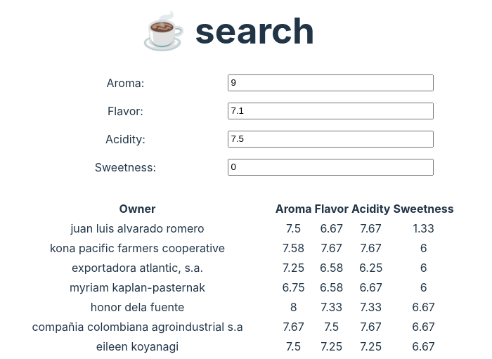

import { Aside, Code, Tabs, TabItem } from '@astrojs/starlight/components';

import { githubPath } from "@/lib/github";
import { repo } from "@/config";

This article is a short introduction to TrailBase and some of its features.
We'll bootstrap a database with coffee data, implement a custom TypeScript HTTP
handler for finding the best matches using vector search, and deploy a simple
production-ready web app all in ~100 lines of code.

<div class="flex justify-center">
  <div class="w-[460px] shadow-lg	 ">
    
  </div>
</div>

<div class="h-[24px]" />

The conclusion of this tutorial is part of the main code repository and can be found
<a href={"examples/coffee-vector-search"}>here</a>
or downloaded by running:

<Code
  code={`
$ git clone ${repo}
$ cd trailbase/examples/coffee-vector-search
  `}
  lang="bash"
  frame="none"
/>

import GettingTrailBase from "./_getting_trailbase.mdx";

<GettingTrailBase/>

## Importing Data

Before building the app, let's import some data. Keeping it simple,
we'll use the `sqlite3` CLI[^1] directly to import
`examples/coffee-vector-search/arabica_data_cleaned.csv` with the following SQL
script:

import importScript from "@root/examples/coffee-vector-search/import.sql?raw";

<Code
  code={importScript}
  lang="sql"
  title={"examples/coffee-vector-search/import.sql"}
  mark={[]}
/>

Note that we didn't initialize the vector `embedding`. This is merely because
`sqlite3` doesn't have the necessary extensions built-in.
We'll update the entries later on, adding the embedding as part of our initial
database migrations[^2].

From within the `example/coffee-vector-search` directory, you can execute the script
above and import the coffee data by running:

```bash
$ mkdir -p traildepot/data
$ cat import.sql | sqlite3 traildepot/data/main.db -
```

After importing the data while still in the same directory, we can start the
`trail` server:

```bash
$ trail run
```

Because `trail` starts for the first time the migrations in
`traildepot/migrations` will be applied, which are essentially:

```sql
UPDATE coffee SET embedding = vec_f32(FORMAT("[%f, %f, %f, %f]", Aroma, Flavor, Acidity, Sweetness));
```

initializing the previously skipped `coffee.embedding` for all records.


## Custom Endpoints

We can use WASM components to declare custom HTTP API routes among other things.
Any time you start `trail run`[^3], WebAssembly components, i.e. `.wasm` files,
under `traildepot/wasm` will be loaded (compiled from WASM IR to native) and
initialized.
So let's get started.

### Project Setup

First we need to set up the project in which the code for our endpoints lives
and which ultimately compiles into a `.wasm` component:

export const tsSetup = `
mkdir endpoint
cd endpoint

# Init a node ESM project:
npm init -y
npm pkg set type="module";

# Install dependencies:
npm install -D vite typescript ts-node eslint prettier @types/node @bytecodealliance/jco
npm install trailbase-wasm

# Init TypeScript:
npx tsc --init
touch index.ts

# Init Vite:
echo "import { defineConfig } from 'vite'

export default defineConfig({
  build: {
    lib: {
      entry: './index.ts',
      formats: ['es'],
      fileName: 'index',
    },
    rollupOptions: {
      preserveEntrySignatures: 'strict',
      external: /(wasi|trailbase):.*/,
    },
  },
})" > vite.config.ts

# Build empty 'index.ts' to check everything works:
npx vite build
`;

export const rustSetup = `
cargo init --lib endpoint
cd endpoint
cargo add trailbase-wasm

echo '
[lib]
crate-type = ["cdylib"]
' >> Cargo.toml
`;

<Tabs>
  <TabItem label="TypeScript">
    <Code code={tsSetup} lang="bash" />
  </TabItem>

  <TabItem label="Rust">
    <Code code={rustSetup} lang="bash" />
  </TabItem>
</Tabs>

### Implementation

With the project set up, we can define the actual endpoint to find our desired
coffee.
Alternatively, you can peek in `examples/coffee-vector-search/guests` to see the result.

import handlerTsCode from "@root/examples/coffee-vector-search/guests/typescript/src/index.ts?raw";
import handlerRustCode from "@root/examples/coffee-vector-search/guests/rust/src/lib.rs?raw";

<Tabs>
  <TabItem label="TypeScript">
    <Code
      code={handlerTsCode}
      lang="ts"
      title={"examples/coffee-vector-search/guests/typescript/src/index.ts"}
      mark={[]}
    />
  </TabItem>

  <TabItem label="Rust">
    <Code
      code={handlerRustCode}
      lang="rust"
      title={"examples/coffee-vector-search/guests/rust/src/lib.rs"}
      mark={[]}
    />
  </TabItem>
</Tabs>

### Building

Lastly, we need to build the `.wasm` component that we can copy into
`<traildepot>/wasm/` for the `trail` binary to pick up:

export const tsBuild = `
# Build a JavaScript library from our TypeScript endpoint:
npx run vite build

# Build the WASM component:
npx jco componentize dist/index.js -w node_modules/trailbase-wasm/wit -o dist/component.wasm

# Copy it to our <traildepot>/wasm
mkdir -p <traildepot>/wasm
cp dist/component.wasm <traildepot>/wasm/
`;

export const rustBuild=`
cargo build --target wasm32-wasip2  --release

# Copy it to our <traildepot>/wasm
mkdir -p <traildepot>/wasm
cp target/wasm32-wasip2/release/endpoint.wasm <traildepot>/wasm/
`;

<Tabs>
  <TabItem label="TypeScript">
    <Code
      code={tsBuild}
      lang="bash"
    />
  </TabItem>

  <TabItem label="Rust">
    <Code
      code="TODO"
      lang="bash"
    />
  </TabItem>
</Tabs>

That's it, we're done with the custom server-side endpoint using vector search
to find the best coffee.

With component in our `<traildepot>/wasm` folder and `trail run` up, we can
test the public `/search` endpoint:

```bash
$ curl "http://localhost:4000/search?aroma=8&flavor=8&acidity=8&sweetness=8"
[
  ["juan luis alvarado romero",7.92,7.58,7.58,8],
  ["eileen koyanagi",7.5,7.33,7.58,8],
  ...
]
```

## A simple Web UI

After setting up our database, vector search and API, we're mostly done with
the TrailBase-specific parts.
Just for good measure, we're also building a simple web UI to consume our API
and tie everything neatly together.
It's quick and lets us touch more generally on bundling and deploying web
applications with TrailBase.
The consumer could equally be a mobile app, some other backend or something
entirely different.

### Implementation

Note that this is not a web dev tutorial. The specifics of the UI aren't the
focus. We chose React as a well-known option and kept the implementation to
less than 80 lines of code.
In case you want to build your own, we recommend
[vite](https://vite.dev/guide/) to quickly set up an SPA with your favorite JS
framework, e.g.: `npm create vite@latest my-project -- --template react`.

Our provided reference implementation, renders 4 numeric input fields to search
for coffee with a certain aroma, flavor, acidity and sweetness score:

import uiCode from "../../../../../examples/coffee-vector-search/src/App.tsx?raw";

<Code
  code={uiCode}
  lang="ts"
  title={"examples/coffee-vector-search/src/App.tsx"}
  mark={[]}
/>

We can start a dev-server with the UI from above and hot-reload running:

```bash
$ npm install && npm dev
```

### Deployment: Putting Everything Together

Whether you've followed along or skipped to here, we can now put everything
together.
Let's start by compiling our `JSX/TSX` web UI down to pure HTML, JS, and CSS
artifacts the browser can understand:

```bash
$ npm install && npm build
```

The artifacts are written to `./dist` and can be served alongside our database
as well as custom API by running:

```bash
$ trail run --public-dir dist
```

<Aside type="tip" title="SPA Routing">
If your web app uses client-side routing (e.g., React, Vue, TanStack router),
you can enable an SPA serving mode avoiding 404s when users navigate to non-root paths:

```bash
$ trail run --public-dir dist --spa
```

With `--spa` enabled a request for path`/user/profile` will fall back to `/index.html`.
However requests for files, i.e. paths with a file extension like `/favicon.ico`,
will continue to return 404s.
</Aside>

You can now check out your fully self-contained app under
[http://localhost:4000/](http://localhost:4000/) or browse the coffee data and
access logs in the [admin dashboard](http://localhost:4000/_/admin).
The admin credentials are logged to the terminal on first start.

All[^4] we need to serve our application in production is:

- the `trail` binary,
- the `traildepot` folder containing the data and endpoints,
- the `dist` folder containing our web app.

At the end of the day it's just a bunch of hermetic files without transitively
depending on a pyramid of shared libraries or requiring other services to be up
and running like a separate database server.
This makes it very easy to just copy the files over to your server or bundle
everything in a single container.
`examples/coffee-vector-search/Dockerfile` is an example of how you can both build and
bundle using Docker. In fact,

```
$ docker build -t coffee . && docker run -p 4000:4000 coffee
```

will speed-run this entire tutorial by building and starting the app listening
on [http://localhost:4000/](http://localhost:4000/).

That's it. We hope this was a fun little intro to some of TrailBase's features.
There's more we haven't touched on: CRUD APIs, auth, admin dash, file uploads,
just to name a few.
If you have any feedback, don't hesitate and reach out on
<a href={repo}>GitHub</a>.


## What's Next?

Thanks for making it to the end.
Beyond the basic example above, the repository contains a more involved examples, such as:

* A <a href={githubPath("examples/blog")}>Blog</a>
  with both, a Web and Flutter UI, more complex APIs, authorization and custom
  user profiles.
* A collaborative clicker *game* demonstrating server-side rendering (SSR) with
  popular JS frameworks and *realtime* updates to synchronize state.

Any questions or suggestions? Reach out on GitHub and help us improve the docs.
Thanks!

----

[^1]:
    If you don't have `sqlite3` already installed, you can install it using
    `brew install sqlite`, `apt-get install sqlite3`, or
    [download](https://www.sqlite.org/download.html) pre-built binaries

[^2]:
    Migrations are versioned SQL scripts that will be executed by the database
    on first encounter to programmatically and consistently evolve your database
    schema and data along with your code.
    For example, when you add a new column you'll likely want all your
    integration tests, development setups, and production deployments to add
    the column so your application logic has a consistent schema to target.

[^3]:
    Unless explicitly disabled.

[^4]:
    For sensitive use-cases, e.g. auth, you'll also need certificates for
    integrity and end end-to-end TLS encryption.
    For less sensitive use cases, such as establishing an authority, you could
    fall back to TLS termination via a CDN like cloudflare.
