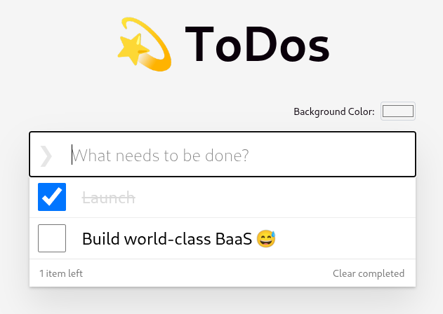
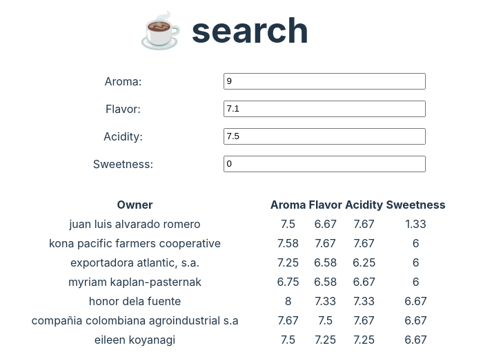

# TrailBase Examples

#### [Blog](blog/)

A simple styled Blog example with UIs both for web and Flutter:

  <picture align="center">
    
  </picture>

  <picture align="center">
    
  </picture>

#### [TanStack/db Synced Todo Example](tanstack-db-sync/)

A simple ToDo App demonstrating the use of
[TanStack/db](https://github.com/TanStack/db) to automatically sync
items and settings across tabs, Browsers and devices.

  <picture align="center">
    
  </picture>

#### [Server-Side Rendered Collaborative Clicker](collab-clicker-ssr/)

A small clicker application, where we can collaboratively make it go 🚀. It
show-cases server-side rendering using SolidJS, however it could equally be
React, Vue, Svelte, Preact, ... . After client-side hydration, click counter
changes are streamed to everyone listening.

  <picture align="center">
     
  </picture>

#### [Coffee Vector Search](coffee-vector-search/)

A small single-page web app demonstrating vector search and custom JS/TS endpoints.

  <picture align="center">
    
  </picture>

#### [Data CLI App](data-cli-tutorial/)

A brief example of how TrailBase can be used in an command-line app to ingest
IMDB data and query it. This code belongs to the
[CLI tutorial](https://trailbase.io/getting-started/first-cli-app):

#### [Custom Rust Binary](custom-binary/)

A quick example showcasing how one can use TrailBase as a library.
